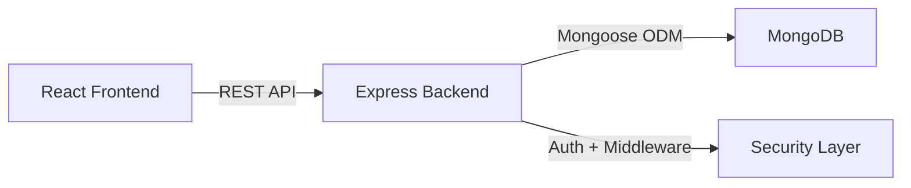

# 🚀 Team Task Manager — Full Stack Production App

> A scalable, production-ready **Team & Task Management System** built using React, Node.js, and MongoDB with a modern monorepo architecture.

---

## 🌟 Key Highlights (Recruiter Focus)

* 🔐 Secure Authentication (JWT + bcrypt)
* 👥 Role-Based Access Control (RBAC)
* 📋 Task & Project Management System
* ⚡ Monorepo Architecture (Frontend + Backend + Shared Libs)
* 🧠 Type-Safe API using Zod
* 🚀 Production-ready backend with logging & security middleware
* 🐳 Docker support for deployment

---

## 🛠️ Tech Stack

| Layer      | Technology                               |
| ---------- | ---------------------------------------- |
| Frontend   | React 18, TypeScript, Vite, Tailwind CSS |
| Backend    | Node.js, Express.js, TypeScript          |
| Database   | MongoDB (Mongoose)                       |
| Validation | Zod                                      |
| Auth       | JWT, bcrypt                              |
| Logging    | Pino                                     |
| Dev Tools  | concurrently, tsx, eslint, prettier      |

---

## 🏗️ Architecture



---

## 📂 Project Structure

```bash
team-manager/
├── frontend/        # React UI (Vite)
├── backend/         # Express API (TypeScript)
├── lib/             # Shared modules (Zod, DB, API client)
├── scripts/         # Utility scripts
└── package.json     # Monorepo config
```

---

## ⚙️ Environment Variables

Create `.env` file:

```env
PORT=8080
FRONTEND_PORT=5173
BACKEND_URL=http://localhost:8080
JWT_SECRET=your_secret_key
COOKIE_NAME=ttm_session
MONGODB_URI=your_mongodb_uri
NODE_ENV=development
```

---

## 🚀 Getting Started

```bash
# Clone repo
git clone https://github.com/Harsh-Bhardwajj/teamManger.git

# Move into project
cd teamManger

# Install dependencies
npm install

# Run project
npm run dev
```

---

## 🌍 Local URLs

* Frontend → http://localhost:5173
* Backend → http://localhost:8080

---

## 🔥 Core Features

### 🔐 Authentication

* JWT-based login/signup
* Secure password hashing using bcrypt

### 👥 Team Management

* Create & manage teams
* Assign roles (admin/user)

### 📋 Task Management

* Create, update, delete tasks
* Assign tasks to users
* Track progress

### 🛡️ Security

* Helmet (security headers)
* Rate limiting
* CORS protection

---

## 📊 Performance & Engineering

* ⚡ Fast build using Vite
* 🧠 Type-safe backend with TypeScript + Zod
* 📦 Monorepo architecture for scalability
* 🔄 Concurrent frontend + backend development

---

## 🧪 Testing

```bash
npm run test
npm run test:watch
```

* Unit & integration testing using Jest & Supertest

---

## 🚀 Deployment

### Docker

```bash
docker build -t team-manager .
docker run -p 8080:8080 team-manager
```

### Cloud (Recommended)

* Render / Railway → Backend
* Vercel → Frontend

---

## 📈 Future Enhancements

* 🔔 Real-time notifications (WebSockets)
* 📊 Analytics dashboard
* 📱 Mobile responsive UI
* 🔑 OAuth login (Google/GitHub)

---

## 💼 Resume Value (IMPORTANT)

This project demonstrates:

* Full-stack development (MERN-style architecture)
* Clean code architecture & scalability
* API design & authentication systems
* Real-world problem solving
* Production-level practices (security, logging, validation)

---

## 👨‍💻 Author

**Harsh Bhardwaj**
🔗 https://github.com/Harsh-Bhardwajj

---

## ⭐ Support

If you like this project, give it a ⭐ on GitHub!

---

## 📌 Tip for Recruiters

> This project is built with a focus on scalability, maintainability, and real-world backend practices, making it suitable for production-level applications.
